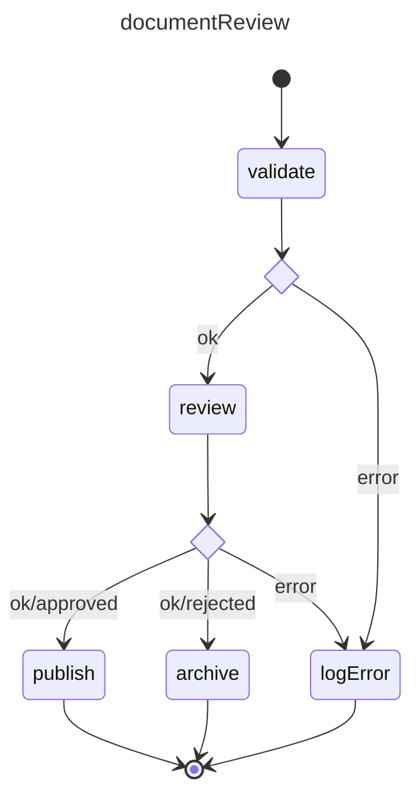
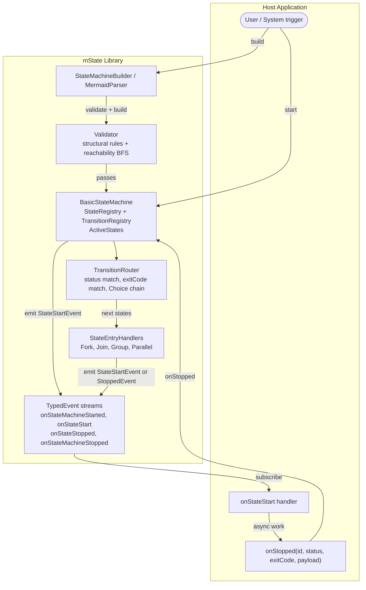

# mState

A TypeScript library for building **hierarchical, event-driven state machines**. Define workflows declaratively, let mState drive execution, and focus your code on what each state actually does.

## Project Background

`mState` is part of an exploration into how far AI-assisted development can go when building a non-trivial tools, widgets and apps. This project has been built based on a human defined architecture, co-authored functional spec and a series of interface contracts, then implemented using using Claude, Qwen and to a lesser extent Gemini.

---

## Goals

- **Declarative workflow definition** — describe states and transitions; mState handles routing.
- **Strong type safety** — branded `StateId`, `TransitionId`, and `StateMachineId` types catch wiring mistakes at compile time.
- **Payload as first-class signal** — data flows from the initial trigger through every state to the final outcome; no global state needed.
- **Parallel execution** — Fork/Join states express concurrent work without async plumbing in the workflow definition.
- **Early validation** — `validate()` catches structural errors (missing Initial, orphaned transitions, unreachable terminals) before a machine ever runs.
- **Multiple authoring styles** — build programmatically with `StateMachineBuilder`, or parse a Mermaid state diagram with `createStateModel`.

---

## Use cases

| Scenario | How mState helps |
|---|---|
| Multi-step API pipelines | Chain fetch → transform → persist with error branches per step |
| Document approval flows | Route on exit codes (`ok/approved`, `ok/rejected`) without extra conditionals |
| Parallel service calls | Fork branches, collect results in a Join, merge payloads |
| Background job orchestration | Composite Group states encapsulate sub-workflows as a single logical step |
| Wizard / guided UI flows | States map to screens; transitions encode valid navigation paths |

---

## Installation

No npm package is published yet. Install directly from GitHub:

```bash
# via npm
npm install github:fultslop/mstate

# or pin to a specific commit
npm install github:fultslop/mstate#<commit-sha>
```

Or clone and link locally:

```bash
git clone https://github.com/fultslop/mstate.git
cd mstate
npm install
npm run build
npm link

# in your project
npm link mstate
```

---

## Quick start — document review pipeline

### The scenario

A document goes through three stages:

1. **validate** — check the document is well-formed.
2. **review** — a human (or service) decides: `approved` or `rejected`.
3. **publish** (approved path) or **archive** (rejected path) — final disposition.

Any stage can fail; errors route to a **log-error** state before terminating.

### Mermaid diagram



### Code

There are two approaches to implement this diagram:

* Implement the statediagram by code.
* Use the mermaid parser to create the diagram for you.

**Implementation by code**

```typescript
import {
  StateMachine,
  StateMachineBuilder,
  StateStatus,
} from 'mstate';
import type {
  SMStateStartEvent,
  SMStateMachineId,
  SMStateId,
  SMTransitionId,
} from 'mstate';

// ── 1. Create the machine and builder ─────────────────────────────────────────

const machine = new StateMachine('documentReview' as SMStateMachineId);
const b = new StateMachineBuilder(machine);

// ── 2. Define states ──────────────────────────────────────────────────────────

b.createInitial('_start'           as SMStateId);
b.createState('validate'           as SMStateId);
b.createChoice('validateOutcome'   as SMStateId);  // branches on ok vs error
b.createState('review'             as SMStateId);
b.createChoice('reviewOutcome'     as SMStateId);  // branches on approved vs rejected vs error
b.createState('publish'            as SMStateId);
b.createState('archive'            as SMStateId);
b.createState('logError'           as SMStateId);
b.createTerminal('_end'            as SMStateId);

// ── 3. Wire transitions ───────────────────────────────────────────────────────

// Each UserDefined state has exactly one outgoing transition (to its Choice).
// All branching is done by Choice states.

b.createTransition('t0' as SMTransitionId, '_start'  as SMStateId, 'validate'        as SMStateId);

// validate → validateOutcome (unconditional; Choice does the branching)
b.createTransition('t1' as SMTransitionId, 'validate'        as SMStateId, 'validateOutcome' as SMStateId);
b.createTransition('t2' as SMTransitionId, 'validateOutcome' as SMStateId, 'review'          as SMStateId, StateStatus.Ok);
b.createTransition('t3' as SMTransitionId, 'validateOutcome' as SMStateId, 'logError'        as SMStateId, StateStatus.Error);

// review → reviewOutcome (unconditional; exit code flows into Choice)
b.createTransition('t4' as SMTransitionId, 'review'          as SMStateId, 'reviewOutcome'   as SMStateId);
b.createTransition('t5' as SMTransitionId, 'reviewOutcome'   as SMStateId, 'publish'         as SMStateId, StateStatus.Ok, 'approved');
b.createTransition('t6' as SMTransitionId, 'reviewOutcome'   as SMStateId, 'archive'         as SMStateId, StateStatus.Ok, 'rejected');
b.createTransition('t7' as SMTransitionId, 'reviewOutcome'   as SMStateId, 'logError'        as SMStateId, StateStatus.Error);

// terminal transitions
b.createTransition('t8' as SMTransitionId, 'publish'  as SMStateId, '_end' as SMStateId);
b.createTransition('t9' as SMTransitionId, 'archive'  as SMStateId, '_end' as SMStateId);
b.createTransition('tA' as SMTransitionId, 'logError' as SMStateId, '_end' as SMStateId);

// ── 4. Validate structure before running ──────────────────────────────────────

machine.validate(); // throws SMValidationException on misconfiguration

// ── 5. Subscribe to state activations ────────────────────────────────────────

machine.onStateStart.add((evt) => {
  // Fork emits an array; all other states emit a single event.
  const events = Array.isArray(evt) ? evt : [evt];

  for (const e of events) {
    handleState(e);
  }
});

machine.onStateMachineStopped.add((evt) => {
  console.log('Pipeline finished:', evt.stateStatus, evt.payload);
  // evt.payload is whatever the last onStopped call produced.
});
```

For the user side, we implement an event-based handler simulating the execution of the review process.

```ts
// ── 6. Implement state work ───────────────────────────────────────────────────

type Doc = { content: string; valid?: boolean; decision?: string };

function handleState(evt: SMStateStartEvent): void {
  const id    = evt.toStateId;
  const doc   = evt.payload as Doc;

  switch (id) {
    case 'validate':
      // Synchronous example — async works equally well via .then()
      if (doc.content.trim().length > 0) {
        machine.onStopped(id, StateStatus.Ok, undefined, { ...doc, valid: true });
      } else {
        machine.onStopped(id, StateStatus.Error, undefined, doc);
      }
      break;

    case 'review':
      // Simulate an async human decision
      simulateReview(doc).then((decision) => {
        machine.onStopped(id, StateStatus.Ok, decision, { ...doc, decision });
        //                                    ^^^^^^^^ exitCode: 'approved' | 'rejected'
      }).catch(() => machine.onStopped(id, StateStatus.Error));
      break;

    case 'publish':
      console.log('Publishing document:', doc.content);
      machine.onStopped(id, StateStatus.Ok, undefined, doc);
      break;

    case 'archive':
      console.log('Archiving document:', doc.content);
      machine.onStopped(id, StateStatus.Ok, undefined, doc);
      break;

    case 'logError':
      console.error('Pipeline error at stage:', evt.fromStateId, doc);
      machine.onStopped(id, StateStatus.Ok, undefined, doc);
      break;
  }
}

async function simulateReview(doc: Doc): Promise<string> {
  // Replace with a real API call, user prompt, etc.
  return doc.content.includes('draft') ? 'rejected' : 'approved';
}
```

Finally we start the machine.

```ts
// ── 7. Run ────────────────────────────────────────────────────────────────────

machine.start({ content: 'Final report Q1' } as Doc);
```

**Implementation via the mermaid parser**

`createStateModel` parses a Mermaid `stateDiagram-v2` string and returns ready-to-use `StateMachine` instances — no builder wiring required. It accepts either an inline string or a markdown document containing fenced ` ```mermaid ` blocks.

Reading the diagram text from a file or a remote URL is outside the scope of this library, but either is straightforward:

```typescript
import { createStateModel, StateStatus } from 'mstate';
import type { SMStateStartEvent } from 'mstate';

// ── Option A: Node.js — load a .md / .mmd file ───────────────────────────────

// Pass the file path and { fromFile: true }; createStateModel reads it for you.
const [machine] = await createStateModel('./docs/document-review.md', { fromFile: true });

// ── Option B: browser / Deno / edge — fetch from a URL ───────────────────────

// const text = await fetch('/diagrams/document-review.md').then(r => r.text());
// const [machine] = createStateModel(text);   // inline string overload

// ── Option C: inline string (any environment) ─────────────────────────────────

// const diagram = `
// ---
// title: documentReview
// ---
// stateDiagram-v2
//     [*] --> validate
//     ...
// `;
// const [machine] = createStateModel(diagram);

// ── Wire up handlers (identical to the builder example) ──────────────────────

machine.onStateStart.add((evt) => {
  const events = Array.isArray(evt) ? evt : [evt];
  for (const e of events) handleState(e);
});

machine.onStateMachineStopped.add((evt) => {
  console.log('Pipeline finished:', evt.stateStatus, evt.payload);
});

// handleState is exactly the same function shown in the builder example above.

machine.start({ content: 'Final report Q1' });
```

The machine produced by `createStateModel` is structurally identical to one built with `StateMachineBuilder`; the same `onStateStart` / `onStopped` / `onStateMachineStopped` API applies.

---

## How the architecture fits together

See [docs/architecture.md](docs/architecture.md) for the full document. Below is a condensed map of the moving parts.



**What each box does:**

| Component | Role |
|---|---|
| `StateMachineBuilder` | Fluent API to create states and transitions and register them on a machine |
| `MermaidParser` (`createStateModel`) | Parses a Mermaid `stateDiagram-v2` string into an equivalent machine |
| `Validator` | BFS traversal that enforces structural rules before `start()` is called |
| `BasicStateMachine` | Owns the state/transition registries and tracks which states are active |
| `TransitionRouter` | Given a `(stateId, status, exitCode)` triple, selects the next state(s) to activate |
| `StateEntryHandlers` | Specialised handlers for Fork, Join, Group, and Parallel — invoked by the router when the resolved target needs non-standard activation logic |
| `TypedEvent streams` | Four pub/sub channels the host subscribes to; all events are synchronous and in-process |
| `onStopped()` | The host calls this to hand control back to the machine after completing a state's work |

**Payload** is the data thread that runs through the entire diagram. The value passed to `start()` arrives as `StateStartEvent.payload` in the first state; whatever the host passes to `onStopped(…, payload)` becomes the next state's `payload`; the final value surfaces in `StateMachineStoppedEvent.payload`. See [docs/architecture.md § Payload](docs/architecture.md#5-payload--the-signal-through-the-graph) for the full lifecycle.

---

## State types reference

| Type | Symbol in Mermaid | Purpose |
|---|---|---|
| `Initial` | `[*] -->` source | Entry point; optionally seeds the initial payload |
| `Terminal` | `--> [*]` target | Stops the machine and emits `onStateMachineStopped` |
| `UserDefined` | plain state name | Application work; host receives `onStateStart` and calls `onStopped` |
| `Choice` | `<<choice>>` | Transparent routing node; immediately re-routes based on status/exitCode |
| `Fork` | `<<fork>>` | Activates all outgoing transitions in parallel; optionally clones payload per branch |
| `Join` | `<<join>>` | Waits for all incoming branches to complete; forwards collected payloads |
| `Group` | `state X { ... }` | Composite state encapsulating a sub-machine as a single logical step |
| `Parallel` | `<<parallel>>` | Multiple concurrent regions, each with its own Initial/Terminal |

---

## Development

```bash
npm install          # install dependencies
npm test             # run Jest tests
npm run test:coverage  # tests + coverage report (80 % threshold enforced)
npm run lint         # ESLint check
npm run typecheck    # type-check without emitting
npm run build        # compile to dist/
```

---

## Roadmap / status

- [x] Core state machine engine (Initial, Terminal, UserDefined, Choice)
- [x] Fork / Join parallel execution
- [x] Group (composite) states
- [x] Parallel regions
- [x] Mermaid `stateDiagram-v2` parser
- [x] Structural validator
- [ ] npm package publication v1

---

## License

MIT
