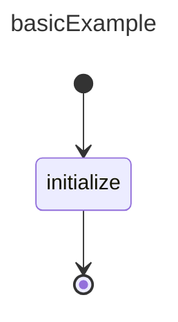

# Basic Single State Example

## Design



## Construction

```ts
const statemachine = new StateMachine("basicExample");

// add states
// createInitial, createState, createTerminal creates the 
// state and adds them to the statemachine
const initial = statemachine.createInitial("initial");
const initializeState = statemachine.createState("initialize");
const terminal = statemachine.createTerminal("terminal"); 


// add transitions
// create should invoke
// transition = {id: id, from: fromId, to: toId }
// statemachine.addTransition(transition)
// outgoing.add(id)
// incoming.add(id)
statemachine.createTransition("t0", createInitial, initializeState);
statemachine.createTransition("t1", initializeState, terminal);

// client code should implement this
statemachine.onSMStarted += (evt: SMStartedEvent) => handleStartEvent();
statemachine.onStateStart += (evt: SMStateStartEvent) => handleStartEvent();
statemachine.onStateStopped += (evt: SMStateStoppedEvent) => handleStopped();
statemachine.onSMStopped += (evt: SMStoppedEvent) => handleStartEvent();

try {
    // validate may throw a SMValidationException exception
    statemachine.validate();
    // state machine may throw a SMRuntimeException
    statemachine.start();
}
catch(e: Exception) {
    // log exception
}
```

**Notes:**
    - The statemachine will keep a list of initial states so on start it knowns which transitions to call
    - if no name is defined for the statemachine, state or transitions the respective object will generate a default id of `statemachine#${crypto.randomUUID()}`, `state#${crypto.randomUUID()}`, `transition#${crypto.randomUUID()}`. 
    

## Execution
- SM calls:     `onStateMachineStart({statemachineId: "basicExample"})`
- SM calls:     `initializeState.setState(status: SMStatus.Active)`
- SM calls:     `onStateStart({fromStateId: "initial", transitionId: "t0", toStateId: "initialize"})`

- client executes `initialize` logic 
- client calls: `statemachine.onStopped({stateId: "initialize", status: SMStatus.Ok})`

- SM calls:     `initializeState.setState(status: SMStatus.Ok)`
- SM calls:     `onStateStopped({stateId: "initialize", status: SMStatus.Ok})`
- SM calls:     `onStateStart({fromStateId: "initialize", transitionId: "t1", toStateId: "terminal"})`
- SM calls:     `onStateMachineStopped({statemachineId: "basicExample", status: SMStatus.Ok})`

**Notes:**
- On the last step the state machine's status is equivalent to the behavior calling the "terminal" state


