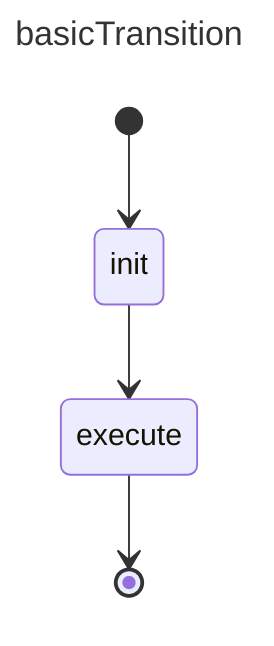

# Basic Transition Example

## References

basicExample: [basic_state example](./002.basic_state.md)

## Design



## Construction

Implementation follows the same patterns as the `basicExample`

```ts
// same as basic example, we won't explicitely mention the overlap
// add states
const initState = createState("init");
const executeState = createState("execute");

statemachine.addState(initState);
statemachine.addState(executeState);

// add transitions
statemachine.createTransition("t1", initState.id, executeState.id);
statemachine.createTransition("t2", executeState.id, terminal.id);

// the rest is the same as `basicExample`
```  

## Execution

- ... First steps are the same as `basicExample`

- SM calls:     `onStateStopped({stateId: "init", status: SMStatus.Ok})`
- SM calls:     `executeState.setState(status: SMStatus.Active)`
- SM calls:     `onStateStart({fromStateId: "init", transitionId: "t1", toStateId: "execute"})`

- client executes `execute` logic 
- client calls: `statemachine.onStopped({stateId: "execute", status: SMStatus.Ok})`

- SM calls:     `executeState.setState(status: SMStatus.Ok)`
- SM calls:     `onStateStopped({stateId: "execute", status: SMStatus.Ok})`
- SM calls:     `onStateMachineStopped({statemachineId: "basicTransition", status: SMStatus.Ok})`

**Notes**

- There is no qualifier on the transitions, this implies that any status coming back from the client will trigger the next states. More on this in future examples.