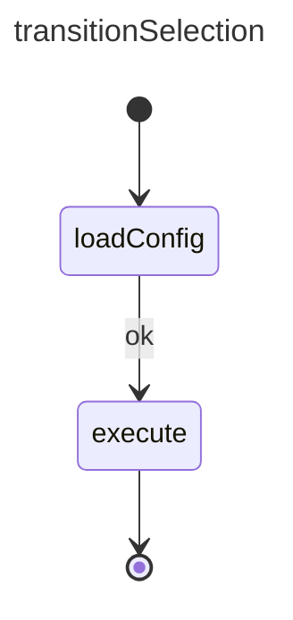

# Transition Narrowing Example

Allows continuation only if a state completes with the exact status / exitcode. If not the statemachine will exit with an error status.

## References

basicExample: [basic_state example](./002.basic_state.md)  
basicTransition: [basic_transition example](./003.basic_transition.md)  

## Design



## Construction

Implementation follows the same patterns as the `basicExample` and `basicTransition`

```ts
// same as basic example, we won't explicitely mention the overlap
// add states
const loadConfigState = createState("loadConfig");
const executeState = createState("execute")

statemachine.addState(loadConfigState);
statemachine.addState(executeState);

// add transitions
const transition2 = new SMTransition("t1", loadConfigChoice.id, executeState.id, SMStatus.Ok);

// the rest is similar to `basicExample`
```  

## Execution
 Execution follows the same pattern basicTransition but depending om the outcome of `loadConfigState` the statemachine will either follow the normal execution flow if  `loadConfigState` exist with  SMStatus.Ok, ie:

- SM calls:     `onStateStopped({stateId: "transitionSelection", status: SMStatus.Ok})`
- SM calls:     `executeState.setState(status: SMStatus.Active)`
- SM calls:     `onStateStart({fromStateId: "loadConfigState", transitionId: "t2", toStateId: "execute"})`

Or in case `logConfigState` exits with error

- SM calls:     `onStateMachineStopped({statemachineId: "transitionSelection", status: SMStatus.Error, payload: "transitionSelection exited with 'SMStatus.Error' required 'SMStatus.Ok'})`

