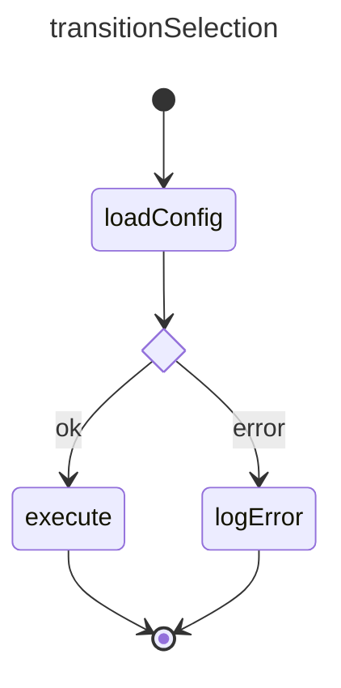
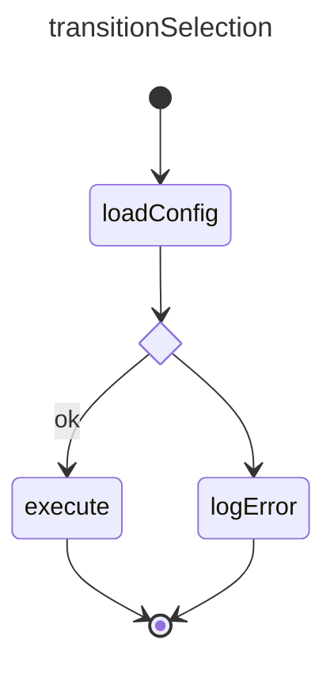

# Transition Selection Example

## References

basicExample: [basic_state example](./002.basic_state.md)  
basicTransition: [basic_transition example](./003.basic_transition.md)  

## Design



## Construction

Implementation follows the same patterns as the `basicExample` and `basicTransition`

```ts
// same as basic example, we won't explicitely mention the overlap
// add states
const loadConfigState = createState("loadConfig");
const loadConfigChoice = createChoice("loadConfigChoice");
const logError = createState("logError");
const executeState = createState("execute")

statemachine.addState(loadConfigState);
statemachine.addState(loadConfigChoice);
statemachine.addState(logError);
statemachine.addState(executeState);

// add transitions
const transition1 = new SMTransition("t1", loadConfigState.id, loadConfigChoice.id);
const transition2 = new SMTransition("t2", loadConfigChoice.id, executeState.id, SMStatus.Ok);
const transition3 = new SMTransition("t3", loadConfigChoice.id, logError.id, SMStatus.Error);

// the rest is similar to `basicExample`
```  

## Execution
 Execution follows the same pattern basicTransition but depending om the outcome of `loadConfigState` the statemachine will either follow  

- SM calls:     `onStateStopped({stateId: "loadConfigState", status: SMStatus.Ok})`
- SM calls:     `executeState.setState(status: SMStatus.Active)`
- SM calls:     `onStateStart({fromStateId: "loadConfigState", transitionId: "t2", toStateId: "execute"})`

Or in case of an error

- SM calls:     `onStateStopped({stateId: "loadConfigState", status: SMStatus.Error})`
- SM calls:     `logError.setState(status: SMStatus.Active)`
- SM calls:     `onStateStart({fromStateId: "loadConfigState", transitionId: "t3", toStateId: "logError"})`

In both cases the statemachine loads the next state to execute, sees its a choice and based on the status, selects the next transition. This choice is not explictely exposed via events.

**Notes**
- If the `choice state` has NO valid options, it will throw an `SMRuntimeException` exception, the model is considered to be 'ill-formed'. This can be pre-empted by calling validate on the statemachine.

- The transitions added to the choice have to be unique. Duplicate transition status / labels will throw an exception during validation. At runtime, the first matching label will be chosen.

- Adding no label is considered the 'default' (or 'else') option. In effect, the example below would work exactly the same as the example above but would also capture all the other result states.


