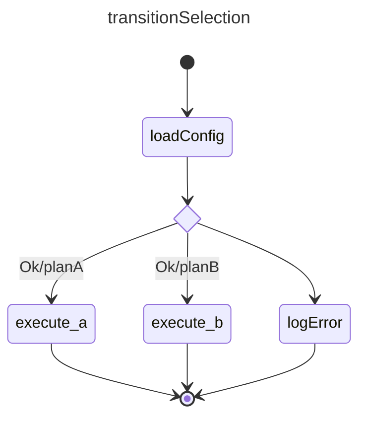

# Transition by exit code

## References

basicExample: [basic_state example](./002.basic_state.md)  
basicTransition: [basic_transition example](./003.basic_transition.md)  
transition_selection: [transition_selection example](./004.transition_selection.md)  


## Design



## Construction

Implementation follows the same patterns as the `basicExample`, `basicTransition` and `transition_selection`

Because state execution may have multiple outcomes with the same status (Ok, Error, ...), transitions may differentiate based on the `status` + `exitcode` of the client's execution. 

```ts
// same as previous examples, we won't explicitely mention the overlap
const loadConfigState = createState("loadConfig");
const loadConfigChoice = createChoice("loadConfigChoice");
const logError = createState("logError");
const executeStateA = createState("execute_a")
const executeStateB = createState("execute_b")

// add states as in previous examples

// add transitions
const transition1 = new SMTransition("t1", loadConfigState.id, loadConfigChoice.id);
const transition2 = new SMTransition("t2", loadConfigChoice.id, executeStateA.id, SMStatus.Ok, "planA");
const transition3 = new SMTransition("t3", loadConfigChoice.id, executeStateB.id, SMStatus.Ok, "planB");
const transition3 = new SMTransition("t4", loadConfigChoice.id, logError.id, SMStatus.AnyStatus);

// the rest is similar to previous examples
```  

## Execution
 Execution follows the same patterns as in previous examples but depending om the outcome of `loadConfigState`. The client will call either:

- client calls: `statemachine.onStopped({stateId: "initialize", status: SMStatus.Ok, exitCode: "planA"})`
OR
- client calls: `statemachine.onStopped({stateId: "initialize", status: SMStatus.Ok, exitCode: "planB"})`
OR
- client calls: `statemachine.onStopped({stateId: "initialize", status: SMStatus.Error})`
