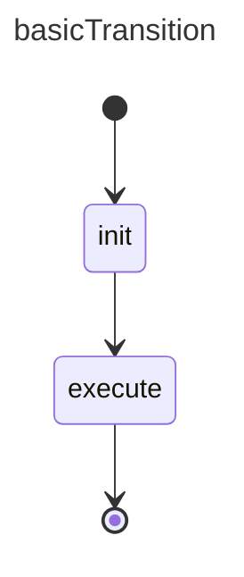

# Payloads Example

States can forward results in the form of payloads. 

## References

basicExample: [basic_state example](./002.basic_state.md)

## Design

## Construction

Implementation follows the same patterns as the `basicExample`

## Execution

- ... First steps are the same as `basicExample`

- SM calls:     `onStateStopped({stateId: "init", status: SMStatus.Ok, payload: number[]})`
- SM calls:     `executeState.setState(status: SMStatus.Active)`
- SM calls:     `onStateStart({fromStateId: "init", transitionId: "t1", toStateId: "execute", payload: number[]})`

- client executes `execute` logic 
- client calls: `statemachine.onStopped({stateId: "execute", status: SMStatus.Ok, payload: Invoices[]})`

- SM calls:     `executeState.setState(status: SMStatus.Ok)`
- SM calls:     `onStateStopped({stateId: "execute", status: SMStatus.Ok})`
- SM calls:     `onStateMachineStopped({statemachineId: "basicTransition", status: SMStatus.Ok, payload: Invoices[]})`

**Notes**

- The State model makes no statements on whether or not these payloads are by reference or copy (eg immer.produce). That choice is up to the implementation.
