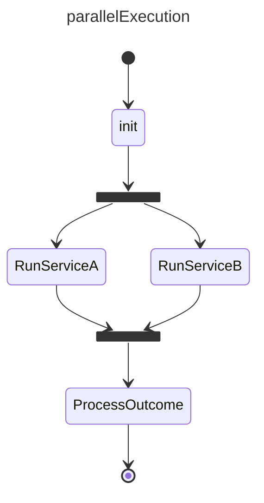
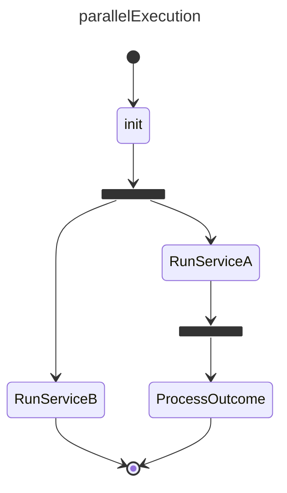

# Fork & Join Example

## References

basicExample: [basic_state example](./002.basic_state.md)  
basicTransition: [basic_transition example](./003.basic_transition.md)  
transition_selection: [transition_selection example](./004.transition_selection.md)  
transition_by_exit_code: [transition_by_exit_code example](./005.transition_by_exit_code.md)  


## Design



## Construction

Implementation follows the same patterns as previous examples

```ts
// add states
const loadConfigState = createState("init");
// fork state can specify how to forward the payload, if ommitted the payload
// will be forwarded by reference. In this case the fork decides to do a deep copy
const forkState = createFork("fork", (payload) => payload?.clone());
const serviceA = createState("RunServiceA");
const serviceB = createState("RunServiceB");
const joinState = new JoinState("join");

// the rest is similar to previous examples
```  

## Execution
 Execution differs from previous patterns in that on fork, the statemachine will call on state start with an array

- SM calls:     `onStateStart([{fromStateId: "fork", transitionId: "f1", toStateId: "RunServiceA"},{fromStateId: "fork", transitionId: "f2", toStateId: "RunServiceB"}] )`

when the SM sees a start event with the to being a join, it will call `JoinState.onDependencyComplete` followed by a check on `JoinState.isComplete`. If so it will continue with:


- SM calls:     `joinState.reset() // make sure the joinState can fire in the future again`
- SM calls:     `onStateStart({fromStateId: "join", transitionId: "j1", toStateId: "ProcessOutcome", payload: <join.receivedPayloads>)`

**Notes**

- The join can never be followed by a choice. This is to make sure the multiple status are mapped by to a single status and a choice can be made. If this is detected during validation an exception will be thrown. If this happens during runtime, the choice will always be selecting "ok" or "any" (if available) as that is the status of the join when completing.

- If any forked states call the TERMINATE, instead of the JOIN, the SM will exit. This will be called out as an exception during Validation. Eg:


