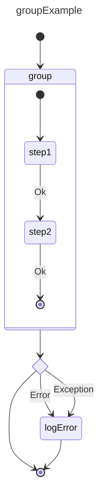

# Group execution Example

A group allows treating a collection of states as if it was a single state.


## References

basicExample: [basic_state example](./002.basic_state.md)

## Design



## Construction

Implementation follows the same patterns as the `basicExample`

```ts
// same as previous examples
// add states
// createGroup, createState, createChoice, creates group and calls 
// addState
const initial    = statemachine.createInitial("init");
const groupState = statemachine.createGroup("group");
const groupInit  = statemachine.createInitial("groupInit");
const step1State = statemachine.createState("step1");
const step2State = statemachine.createState("step2");
const choice     = statemachine.createChoice("choice");

groupState.addState(step1State);
groupState.addState(step2State);

// add transitions
statemachine.createTransition("t0", init.id, groupState.id);
statemachine.createTransition("t1", groupInit.id, step1State.id);
// other transitions
statemachine.createTransition("tN", groupState.id, choice.id);

// the rest is the same as previous examples
```  

## Execution

- ... First steps are the same as previous examples

- SM calls: `onStateStart({fromStateId: "init", transitionId: "t0", toStateId: "group"})`
- SM at this point will find all initial states in group and executes them
- SM calls: `onStateStart({fromStateId: "groupInit", transitionId: "t1", toStateId: "step1"})`

when step2 completes with ok

- SM calls:     `onStateStopped({stateId: "group", status: SMStatus.Ok})`

in case of step1 or step2 exiting with anything but "Ok"

- SM calls:     `onStateStopped({stateId: "group", status: <SMStatus.status !== Ok>})`

rest of calls proceed as described before
