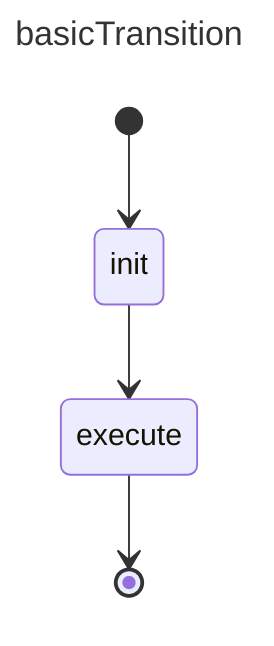

# Configuration Example

Allows setting the configuration of states or statemachines. 

## References

basicExample: [basic_state example](./002.basic_state.md)

## Design

The config in the design is a yaml followed by the 'smConfig' keyword. 

```yaml smConfig
# name of the model
basicTransition: {
    config: {  
        # configs are standard json
        property1: value1,
        property2: [value]
    },
    
    initial: {
        # initial payload setting - also json
        someProperty: value
        # ...
    },
    states: {
        
        execute: {
            config: {
                # also json   
            }
        },
        # init has no config in this example
        hypotheticalGroup: {
            # If defined overrides the payload coming from the statemachine
            initial: {

            },
            # in case of parallels (see 011)           
            initials: [
                # initial configs have no id in the design
                # so they go in order of declaration
                {
                    #json
                },
            ],
            config: {
                # group config
            }
        }
        
    }
}
```



## Construction

Implementation follows the same patterns as the `basicExample`

```ts
// same as basic example, we won't explicitely mention the overlap
const statemachine = new StateMachine(
    "basicTransition",
    // config 
    {
        property1: "value1"
    }
  
);


// add states
const initState = statemachine.createInitial(
    "init",   // initial payload 
    {
        propertyX: [1,2,3]
    }
);
const executeState = statemachine.createState(
    "execute", 
    {
        configProperty: "foo"
    }
);

// the rest is the same as `basicExample`
```  
**Notes**

- The configs are meant for the user-side code. Client code executing states can query the statemachine to get these configuration. These settings a limited to basic json. Same applies for the initial payload values in the init nodes.
