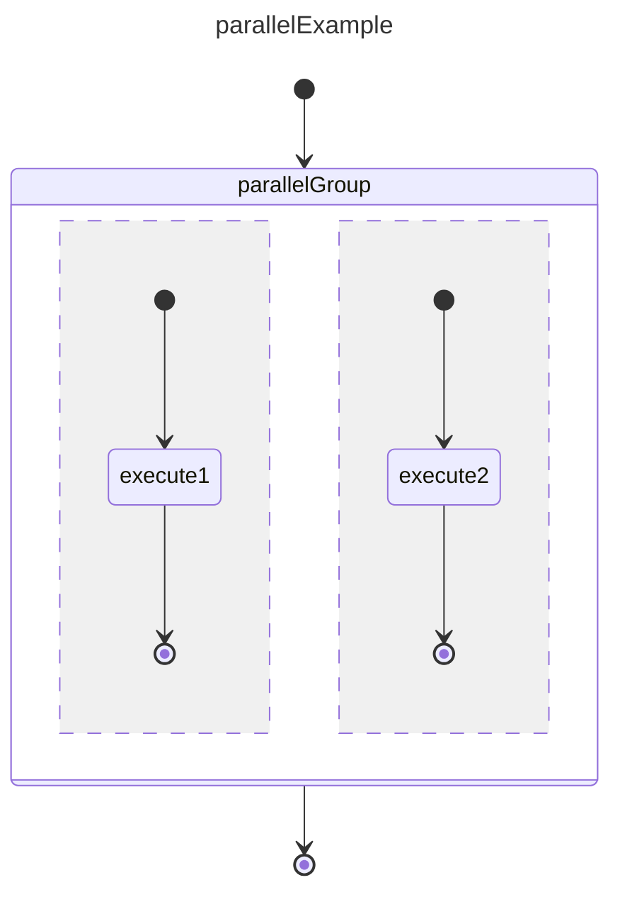

# Parallel execution Example

Semantic differences from a fork. Transition outside the group cancels all the processes inside the group.

## Design



## Construction

```ts
// same as in the previous examples
// add states
const groupState = stateMachine.createGroup("parallelGroup");
const initRoot = stateMachine.createInitial("initRoot");

const init1 = stateMachine.createInitial("init1");
const init2 = stateMachine.createInitial("init2");

statemachine.addState(initState);
statemachine.addState(executeState);

// add transitions
statemachine.createTransition("t1", initState.id, executeState.id);
statemachine.createTransition("t2", executeState.id, terminal.id);

// the rest is the same as `basicExample`
```  

## Execution

- ... First steps are the same as `basicExample`

- SM calls:     `onStateStopped({stateId: "init", status: SMStatus.Ok})`
- SM calls:     `executeState.setState(status: SMStatus.Active)`
- SM calls:     `onStateStart({fromStateId: "init", transitionId: "t1", toStateId: "execute"})`

- client executes `execute` logic 
- client calls: `statemachine.onStopped({stateId: "execute", status: SMStatus.Ok})`

- SM calls:     `executeState.setState(status: SMStatus.Ok)`
- SM calls:     `onStateStopped({stateId: "execute", status: SMStatus.Ok})`
- SM calls:     `onStateMachineStopped({statemachineId: "basicTransition", status: SMStatus.Ok})`

**Notes**

- There is no qualifier on the transitions, this implies that any status coming back from the client will trigger the next states. More on this in future examples.