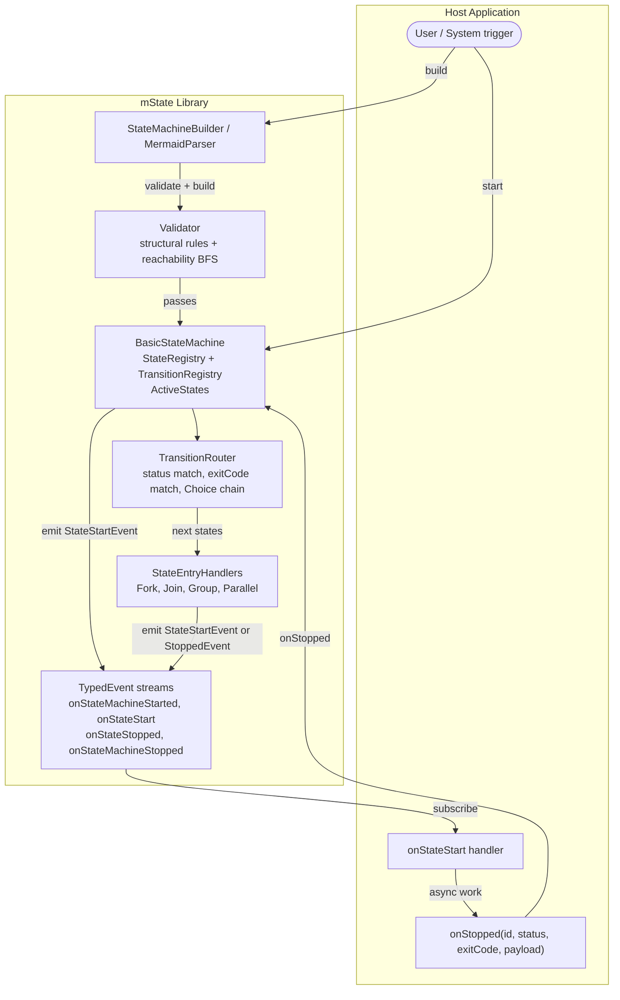

# mState — Software Architecture Document

---

## 1. High-Level Overview

Modern applications frequently require complex, multi-step workflows where execution branching, parallel processing, and error recovery must be coordinated reliably. Ad-hoc approaches to this problem—nested conditionals, flags, and callback chains—are hard to reason about, test, and extend. mState is a TypeScript library that models these workflows as hierarchical, event-driven state machines, giving developers a declarative, validated, and strongly-typed abstraction over workflow logic. It provides builders for programmatic construction, a Mermaid diagram parser for visual authoring, and a reactive event system so host applications can drive and observe state machine execution without coupling business logic to orchestration code.

---

## 2. Tech Stack & Rationale

| Component | Technology | Why this? |
|---|---|---|
| Language | TypeScript | Strong static typing; branded types enforce correctness at compile time |
| Module system | ESM (with CJS interop) | Tree-shakeable; compatible with modern bundlers and Node.js |
| Test runner | Jest | Mature ecosystem; co-located `*.test.ts` files keep tests close to source |
| Linter | ESLint + Prettier | Automated style enforcement; `lint:fix` in CI |
| Dead-code detection | Knip | Catches unused exports before publish |
| Local registry | Verdaccio | Publish/consume packages without hitting npmjs.com during development |
| Build | tsc | Direct TypeScript compiler; no bundler overhead for a library |
| Diagram parsing | Custom Mermaid parser | Lets non-engineers author state machines visually without coding |

### Non-Goals

- **Not a workflow orchestration server.** mState has no server, database, or process manager. Persistence of state machine snapshots is left to the host application.
- **Not an async runtime.** mState emits synchronous events. Async work happens in the host; the host calls `onStopped` when that work completes.
- **Not a UI framework.** Rendering or visualisation of running state machines is out of scope.
- **Not a rules engine.** Transition selection is based on `StateStatus` and `exitCode` only; general predicate evaluation is not provided.
- **Not distributed.** There is no concept of remote states, distributed locking, or cross-process messaging.
- **Not a general event bus.** The `TypedEvent` helper is intentionally minimal; it does not replace RxJS, EventEmitter, or similar libraries.

---

## 3. Architecture Diagram



---

## 4. Data Schema

### Primary Entities

```
StateMachine
├── id: StateMachineId          (branded string)
├── StateRegistry               (map of StateId → State)
├── TransitionRegistry          (map of TransitionId → Transition)
└── activeStates: Set<StateId>

State
├── id: StateId                 (branded string)
├── type: StateType             (Initial | Terminal | Choice | Fork | Join |
│                                Group | Parallel | UserDefined)
├── stateStatus: StateStatus    (None | Active | Ok | Error | Canceled |
│                                Exception | AnyStatus)
├── config: Record<string,unknown>   (host-defined metadata)
├── incoming: Set<TransitionId>
├── outgoing: Set<TransitionId>
└── parentId?: StateId          (set for nested / grouped states)

  JoinState extends State
  └── receivedPayloads: StateStartEvent[]   (collected from each branch)

  GroupState / ParallelState extends State + StateContainer
  └── stateIds, transitionIds   (owned child graph)

Transition
├── id: TransitionId            (branded string)
├── fromStateId: StateId
├── toStateId: StateId
├── status?: StateStatus        (undefined = always matches)
├── exitCode?: string           (secondary discriminator)
└── parentId?: StateId          (for transitions inside a group)
```

### Entity Relationships

- A **StateMachine** owns zero or more **States** and zero or more **Transitions**.
- A **State** has many-to-many relationships with **Transitions** via its `incoming` and `outgoing` sets.
- **GroupState** and **ParallelState** are both States and StateContainers — they own a nested sub-graph of States and Transitions.
- A **Transition** connects exactly two States (from → to) and optionally carries a status/exitCode filter.

---

## 5. Payload — The Signal Through the Graph

Every event in mState carries an optional `payload: unknown` field. Payload is the single data channel that flows through the entire state machine from start to finish; it is not a side channel or debugging aid — it is the primary mechanism for passing inputs in and reading results out.

### Lifecycle of a payload

```
start(initialPayload)
    │
    ▼
StateMachineStartedEvent { payload }
    │
    ▼  ──────────────────────────────────────────────────────────────
    │  For each state activation:
    │
    │  StateStartEvent { payload }   ← host receives this payload
    │        │
    │        │  host does work, then calls:
    │        ▼
    │  onStopped(id, status, exitCode, resultPayload)
    │        │
    │        │  resultPayload is forwarded as the next StateStartEvent.payload
    │        ▼
    │  ... next state ...
    │  ──────────────────────────────────────────────────────────────
    │
    ▼
StateMachineStoppedEvent { payload }   ← final outcome read here
```

### Key rules

| Situation | Payload behaviour |
|---|---|
| Normal transition | The payload passed to `onStopped` becomes the `payload` of the next `StateStartEvent` unchanged |
| Initial state | The payload supplied to `start()` is forwarded as the first `StateStartEvent.payload` |
| Fork state | Each parallel branch receives the same payload reference by default; a `clonePayload` function can be provided to the Fork state to give each branch an independent copy |
| Join state | All branch payloads are collected in `receivedPayloads: StateStartEvent[]`; the host reads this array on the Join's `StateStartEvent` to inspect per-branch results before calling `onStopped` with a merged payload |
| Terminal state | The payload passed to `onStopped` on the terminal state becomes the `payload` of `StateMachineStoppedEvent` — this is the graph's final output |
| Group / Parallel | Entry into a group forwards the incoming payload to the group's own Initial state; the group's terminal payload propagates back out when the group completes |

### Reading the outcome

The host application reads the final result from `StateMachineStoppedEvent`:

```typescript
machine.onStateMachineStopped.add(evt => {
  // evt.stateStatus — Ok, Error, Canceled, etc.
  // evt.payload     — whatever the last onStopped call produced
  console.log('Result:', evt.stateStatus, evt.payload);
});
```

Because payload is typed as `unknown`, callers cast to their domain type. A recommended pattern is to define a typed wrapper and assert at the boundary:

```typescript
type OrderResult = { orderId: string; total: number };

machine.onStateMachineStopped.add(evt => {
  if (evt.stateStatus === StateStatus.Ok) {
    const result = evt.payload as OrderResult;
    // ...
  }
});
```

---

## 6. API Design Strategy

### Communication Protocol — Events

mState uses a synchronous publish/subscribe model via `TypedEvent<T>`. All events are emitted in-process; there is no network transport.

| Event | Emitted when | Key fields |
|---|---|---|
| `StateMachineStartedEvent` | `start()` is called | `statemachineId`, `payload` |
| `StateStartEvent` | A state becomes active | `fromStateId`, `transitionId`, `toStateId`, `payload` |
| `StateStoppedEvent` | A state's work completes | `stateId`, `stateStatus`, `exitCode`, `payload` |
| `StateMachineStoppedEvent` | A Terminal state is reached | `statemachineId`, `stateStatus`, `payload` |

**Subscription pattern** (host side):

```typescript
machine.onStateStart.add(evt => {
  if (evt.toStateId === 'process-order') {
    processOrder(evt.payload).then(result =>
      machine.onStopped(evt.toStateId, StateStatus.Ok, undefined, result)
    ).catch(() =>
      machine.onStopped(evt.toStateId, StateStatus.Error)
    );
  }
});
```

### Transition Selection

The `TransitionRouter` applies the following rules in order:

1. Collect all outgoing transitions from the current state.
2. If `status` is defined on a transition, it must match the reported `StateStatus` (or the transition's status is `AnyStatus`).
3. If `exitCode` is defined, it must match the reported exit code string.
4. A transition with no `status` filter is a default/fallback and always matches.
5. If the resolved target is a **Choice** state, routing continues transparently from that Choice state's outgoing transitions.
6. A **Fork** state emits multiple `StateStartEvent`s — one per outgoing transition — enabling parallel branches.

### Error-Handling Patterns

| Scenario | Mechanism |
|---|---|
| State returns an error | Host calls `onStopped(id, StateStatus.Error)`; a transition filtered on `Error` routes to a recovery or terminal state |
| Exit-code disambiguation | Multiple `Ok` outcomes (e.g., `ok/planA`, `ok/planB`) route to different successor states without extra Choice states |
| Unhandled status | If no transition matches, the state machine halts with an unroutable error event |
| Structural defects | `validate()` (run at build time) catches: missing Initial state, orphaned transitions, AnyStatus+exitCode combinations, unreachable Terminal states |
| Parallel branch failure | Each Fork branch operates independently; Join collects all results, allowing the host to inspect each branch's payload for partial failures |
