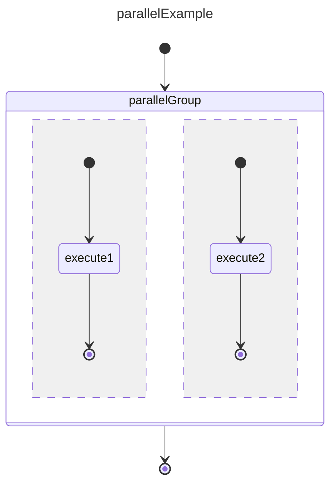

# Parallel Execution Example

A parallel state runs multiple independent regions concurrently. Unlike fork/join, the regions are implicit — there are no explicit fork or join pseudo-states. The parallel state itself is the synchronization boundary: it completes when **all** regions complete, and it cancels all regions if any one fails or if an external transition fires.

## References

basicExample: [basic_state example](./002.basic_state.md)  
basicTransition: [basic_transition example](./003.basic_transition.md)  
forkJoin: [fork_join example](./008.fork_join.md)  
groupExecution: [group_execution example](./009.group.execution.md)  

## Differences from Fork/Join

| Concern | Fork/Join | Parallel |
|---|---|---|
| Entry | Explicit `fork` pseudo-state fans out | Parallel state activates all regions automatically |
| Synchronization | Explicit `join` pseudo-state collects results | Parallel state itself is the barrier |
| Cancellation | Forked branches run to terminal independently | Any non-Ok region cancels all sibling regions |
| External exit | Not supported mid-execution | Transition out of parallel cancels all active regions |
| Payload routing | Fork controls clone/reference via callback | Parallel state forwards payload to each region (by reference unless overridden) |

## Design



Each `--` separator in the mermaid syntax defines a new **region**. Regions run independently and do not share state or transitions.

## Entities

New type added to `StateType`:

```ts
enum StateType {
    // ...existing types
    Parallel = "parallel"
}
```

New entities:

```ts
class Region {
    readonly id: string;

    // States and transitions belonging to this region
    private states: StateId[];
    private transitions: TransitionId[];

    // Tracks region completion during execution
    status: Status;

    addState(id: StateId): void;
    addTransition(id: TransitionId): void;
    deleteState(id: StateId): void;
    deleteTransition(id: TransitionId): void;   
}

class ParallelState implements IState {
    // ...ISMState implementation (type = SMStateType.Parallel)

    // Optional payload clone function; if omitted, payload is forwarded by reference
    payloadClone: ((payload: unknown) => unknown) | undefined;

    createRegion(id: string): Region;
    getRegion(id: string): Region | undefined;
    getRegions(): ReadonlyArray<Region>;
}
```

`StateMachineBuilder` gains a new method:

```ts
createParallel(id: StateId, payloadClone?: (payload: unknown) => unknown): SMParallelState;
```

## Construction

```ts
// Outer machine
const builder       = new StateMachineBuilder(stateMachine);
const initRoot      = builder.createInitial("initRoot");
const parallelGroup = builder.createParallel("parallelGroup");
const terminal      = builder.createTerminal("terminal");

builder.createTransition("t0", initRoot.id, parallelGroup.id);
builder.createTransition("t1", parallelGroup.id, terminal.id);

// Region 1
const region1 = parallelGroup.createRegion("region1");
const init1   = builder.createInitial("init1");
const exec1   = builder.createState("execute1");

const r1t1 = builder.createTransition("r1t1", init1.id, exec1.id);
const r1t2 = builder.createTransition("r1t2", exec1.id, region1.terminal.id);

region1.addState(init1);
region1.addState(exec1);
region1.addTransition(r1t1)
region1.addTransition(r1t2)

// Region 2
const region2 = parallelGroup.createRegion("region2");
const init2   = builder.createInitial("init2");
const exec2   = builder.createState("execute2");

builder.createTransition("r2t1", init2.id, exec2.id);
builder.createTransition("r2t2", exec2.id, region2.terminal.id);

region2.addState(init2);
region2.addState(exec2);
region2.addTransition(r2t1)
region2.addTransition(r2t2)

```

Each `Region` owns an implicit initial and terminal pseudo-state (`region.initial`, `region.terminal`). These are not visible outside the parallel state.

## Execution — happy path

Both regions complete successfully.

- SM calls: `onStarted({statemachineId: "parallelExample", payload: ...})`
- SM activates `initRoot`, immediately follows the unguarded transition
- SM calls: `onStateStart([`  
  `  {fromStateId: "initRoot", transitionId: "t0", toStateId: "parallelGroup"},`  
  `  {fromStateId: "region1.initial", transitionId: "r1t1", toStateId: "execute1"},`  
  `  {fromStateId: "region2.initial", transitionId: "r2t1", toStateId: "execute2"}`  
  `])`

Both `execute1` and `execute2` are now active and running concurrently.

**execute1 finishes first:**

- client calls: `statemachine.onStopped({stateId: "execute1", status: Status.Ok})`
- SM marks region1 complete (`Status.Ok`)
- SM calls: `onStateStopped({stateId: "execute1", stateStatus: Status.Ok, ...})`
- region2 is still active — the parallel state remains active

**execute2 finishes:**

- client calls: `statemachine.onStopped({stateId: "execute2", status: Status.Ok})`
- SM marks region2 complete (`Status.Ok`)
- SM calls: `onStateStopped({stateId: "execute2", stateStatus: Status.Ok, ...})`
- All regions complete with Ok → parallel state itself completes
- SM calls: `onStateStopped({stateId: "parallelGroup", stateStatus: Status.Ok, payload: [region1.payload, region2.payload]})`
- SM follows `t1` to terminal
- SM calls: `onStateMachineStopped({statemachineId: "parallelExample", stateStatus: Status.Ok})`

## Execution — region failure

One region fails; sibling regions are canceled.

- (same entry as above — both execute1 and execute2 are active)

**execute1 reports an error:**

- client calls: `statemachine.onStopped({stateId: "execute1", status: Status.Error})`
- SM marks region1 failed
- SM calls: `onStateStopped({stateId: "execute1", stateStatus: Status.Error, ...})`
- SM cancels all still-active regions (region2 here)
- SM calls: `onStateStopped({stateId: "execute2", stateStatus: Status.Canceled, ...})`
- Parallel state exits with the failing status
- SM calls: `onStateStopped({stateId: "parallelGroup", stateStatus: Status.Error, ...})`
- SM follows the transition qualified for `Status.Error` (or `AnyStatus` if none matches)
- SM calls: `onSMStopped({statemachineId: "parallelExample", stateStatus: Status.Error})`

## Execution — external cancellation

A transition leading out of the parallel state fires before all regions complete (e.g. a timeout or a global error condition). This is an external transition — it is defined on the outer statemachine, not inside a region.

- SM cancels all active states in all regions (one `onStateStopped` with `Status.Canceled` per active state)
- SM calls: `onStateStopped({stateId: "parallelGroup", stateStatus: Status.Canceled, ...})`
- SM follows the external transition normally

## Validation rules

The following are detected at validation time and raise `SMValidationException`:

1. **Region must have exactly one initial state.** A region without an initial state has no defined entry point.
2. **Region must have exactly one terminal pseudo-state.** Without a terminal, the region can never signal completion to the parallel state.
3. **No transition may cross region boundaries.** A transition whose `fromStateId` belongs to region A and whose `toStateId` belongs to region B (or the outer machine) is illegal — regions are independent.
4. **Parallel state may not be followed directly by a choice without an intervening state.** Because the parallel state's exit payload is an array of region payloads, a choice needs an explicit mapping state to reduce it to a single value first.
5. **A region state may not transition directly to the outer terminal.** Bypassing the region terminal means the parallel state can never know that region is done.

## Notes

- The payload forwarded to each region is the same object by default (reference semantics). Pass a `payloadClone` function to `createParallel` when regions must not share mutable payload state.
- The exit payload of the parallel state is an array `[region1.payload, region2.payload, ...]` ordered by region creation order. On failure only the completed regions contribute payloads; canceled regions contribute `undefined`.
- Regions have no concept of ordering or priority. If two regions fail simultaneously, the SM picks the first failure it processes and cancels the rest.
- A parallel state may be nested inside a group, or a group may be nested inside a region. Fork/join constructs may also appear inside a region.
