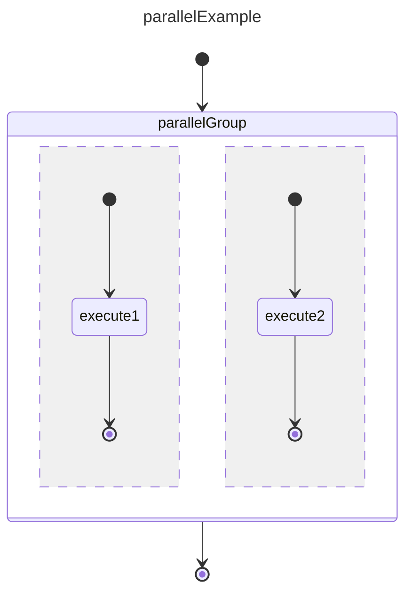

# Parallel Execution Example

A parallel state runs multiple independent regions concurrently. Unlike fork/join, the regions are implicit — there are no explicit fork or join pseudo-states. The parallel state itself is the synchronization boundary: it completes when **all** regions complete, and it cancels all regions if any one fails or if an external transition fires.

## References

basicExample: [basic_state example](./002.basic_state.md)  
basicTransition: [basic_transition example](./003.basic_transition.md)  
forkJoin: [fork_join example](./008.fork_join.md)  
groupExecution: [group_execution example](./009.group.execution.md)  

## Differences from Fork/Join

| Concern | Fork/Join | Parallel |
|---|---|---|
| Entry | Explicit `fork` pseudo-state fans out | Parallel state activates all regions automatically |
| Synchronization | Explicit `join` pseudo-state collects results | Parallel state itself is the barrier |
| Cancellation | Forked branches run to terminal independently | Any non-Ok region cancels all sibling regions |
| External exit | Not supported mid-execution | Transition out of parallel cancels all active regions |
| Payload routing | Fork controls clone/reference via callback | Parallel state forwards payload to each region (by reference unless overridden) |

## Design



Each `--` separator in the mermaid syntax defines a new **region**. Regions run independently and do not share state or transitions.

## Prerequisites — refactoring before implementation

Adding parallel execution to `BasicStateMachine` without preparation will cause it to become a god class. `_enterState` already has branches for Fork, Group, and Join. `_routeFromState` already embeds group-owner lookup. Adding parallel naively adds 5+ more private methods and cross-cutting changes to both methods.

The following refactoring steps must be completed before implementing this spec.

### Step 1 — Extract `StateContainer` interface

`GroupState` and `Region` share the same structural members (child state IDs, child transition IDs, CRUD). Extract the shared contract:

```ts
// src/model/StateContainer.ts
export interface StateContainer {
  readonly stateIds: Set<StateId>;
  readonly transitionIds: Set<TransitionId>;

  hasState(id: StateId): boolean;
  addState(state: State): void;
  deleteState(id: StateId): void;

  hasTransition(id: TransitionId): boolean;
  addTransition(t: Transition): void;
  deleteTransition(id: TransitionId): void;
}
```

Update `GroupState` to extend it:

```ts
// src/model/GroupState.ts
export interface GroupState extends State, StateContainer {}
```

`BasicGroupState` already satisfies `StateContainer` — no implementation changes needed, only the interface declaration.

### Step 2 — Extract `ExecutionContext` interface

`BasicStateMachine` must expose a narrow interface that entry/exit handlers can use, so they can be implemented as separate classes without importing `BasicStateMachine` directly:

```ts
// src/base/ExecutionContext.ts
export interface ExecutionContext {
  // Event emission
  emitStateStart(event: StateStartEvent | StateStartEvent[]): void;
  emitStateStopped(event: StateStoppedEvent): void;
  emitStateMachineStopped(event: StateMachineStoppedEvent): void;

  // Read-only registry access
  getState(id: StateId): State | undefined;
  getTransition(id: TransitionId): Transition | undefined;

  // Active-set management
  markActive(id: StateId): void;
  markInactive(id: StateId): void;

  // Re-entrant routing (used by pseudo-states to continue the chain)
  routeFrom(id: StateId, status: StateStatus, exitCode: string | undefined, payload: unknown): void;
}
```

### Step 3 — Extract per-type entry handlers

Replace the if/else chain in `_enterState` with registered handlers. Each handler is a small focused class:

```ts
// src/base/StateEntryHandler.ts
export interface StateEntryHandler {
  readonly handledType: StateType;
  onEnter(
    ctx: ExecutionContext,
    fromId: StateId,
    transitionId: TransitionId,
    target: State,
    payload: unknown,
  ): void;
}
```

Handlers to create (migrating existing private methods):

| Handler class | Migrates from |
|---|---|
| `GroupEntryHandler` | `_startGroup`, `_findGroupOwner` |
| `ForkEntryHandler` | `_handleFork` |
| `JoinEntryHandler` | join logic inline in `_enterState` |
| `ParallelEntryHandler` | new — implemented in this spec |

`BasicStateMachine._enterState` becomes a pure dispatch:

```ts
private _enterState(fromId, transitionId, toId, payload, status, exitCode): void {
  const target = this._states.get(toId);
  requiresTruthy(target, `Target state '${toId}' not found`);

  target.stateStatus = StateStatus.Active;
  this._active.add(toId);

  const handler = this._entryHandlers.get(target.type);
  if (handler) {
    handler.onEnter(this, fromId, transitionId, target, payload);
  } else {  
    // Default: user-defined state — emit start and wait for onStopped
    this.onStateStart.emit({ fromStateId: fromId, transitionId, toStateId: toId, payload });
  }
}
```

### Step 4 — Extract per-type exit hooks

`onStopped` currently always routes immediately after a state stops. For regions inside a parallel state, a stopped state must first report to the parallel state, which decides whether to continue, aggregate, or cancel. Add an exit hook that handlers can intercept:

```ts
// src/base/StateExitHandler.ts
export interface StateExitHandler {
  readonly handledType: StateType;
  // Return false to suppress default routing (handler takes over)
  onExit(
    ctx: ExecutionContext,
    stateId: StateId,
    status: StateStatus,
    exitCode: string | undefined,
    payload: unknown,
  ): boolean;
}
```

`ParallelExitHandler` (new) intercepts exits from states whose `parentId` belongs to a region owned by a parallel state, updates region status, and either holds (sibling regions still running) or routes the parallel state.

---

## Entities

New value added to `StateType`:

```ts
// src/model/State.ts
export enum StateType {
  // ...existing values
  Parallel = 'parallel',
}
```

New entities:

```ts
// src/base/Region.ts
export class Region implements StateContainer {
  readonly id: string;

  // Owned child states and transitions (same contract as GroupState via StateContainer)
  readonly stateIds: Set<StateId> = new Set();
  readonly transitionIds: Set<TransitionId> = new Set();

  // Implicit pseudo-states created by the Region constructor
  readonly initial: InitialState;
  readonly terminal: TerminalState;

  // Completion status; updated by ParallelEntryHandler / ParallelExitHandler
  status: StateStatus = StateStatus.None;

  // Collected payload when this region's terminal is reached
  payload: unknown = undefined;

  hasState(id: StateId): boolean;
  addState(state: State): void;
  deleteState(id: StateId): void;

  hasTransition(id: TransitionId): boolean;
  addTransition(t: Transition): void;
  deleteTransition(id: TransitionId): void;
}
```

```ts
// src/base/ParallelState.ts
export class ParallelState extends BaseState implements State {
  // type === StateType.Parallel

  // Optional payload clone; if omitted, payload is forwarded by reference to each region
  readonly payloadClone: ((payload: unknown) => unknown) | undefined;

  private readonly _regions: Region[] = [];

  constructor(id: StateId, payloadClone?: (payload: unknown) => unknown, parentId?: StateId);

  createRegion(id: string): Region;
  getRegion(id: string): Region | undefined;
  getRegions(): ReadonlyArray<Region>;
}
```

`StateMachineBuilder` gains one new method:

```ts
// src/base/StateMachineBuilder.ts
createParallel(id: StateId, payloadClone?: (payload: unknown) => unknown, parent?: StateId): ParallelState;
```

---

## Construction

```ts
const sm      = new BasicStateMachine('parallelExample');
const builder = new StateMachineBuilder(sm);

// Outer machine
const initRoot      = builder.createInitial('initRoot');
const parallelGroup = builder.createParallel('parallelGroup');
const terminal      = builder.createTerminal('terminal');

builder.createTransition('t0', initRoot.id, parallelGroup.id);
builder.createTransition('t1', parallelGroup.id, terminal.id);

// Region 1
const region1 = parallelGroup.createRegion('region1');
const init1   = builder.createInitial('init1');
const exec1   = builder.createState('execute1');

const r1t1 = builder.createTransition('r1t1', init1.id, exec1.id);
const r1t2 = builder.createTransition('r1t2', exec1.id, region1.terminal.id);

region1.addState(init1);
region1.addState(exec1);
region1.addTransition(r1t1);
region1.addTransition(r1t2);

// Region 2
const region2 = parallelGroup.createRegion('region2');
const init2   = builder.createInitial('init2');
const exec2   = builder.createState('execute2');

const r2t1 = builder.createTransition('r2t1', init2.id, exec2.id);
const r2t2 = builder.createTransition('r2t2', exec2.id, region2.terminal.id);

region2.addState(init2);
region2.addState(exec2);
region2.addTransition(r2t1);
region2.addTransition(r2t2);
```

Each `Region` owns an implicit initial and terminal pseudo-state (`region.initial`, `region.terminal`). These are not visible outside the parallel state.

---

## Execution — happy path

Both regions complete successfully.

- SM calls: `onStateMachineStarted({ statemachineId: 'parallelExample', payload: undefined })`
- SM activates `initRoot`, immediately follows the unguarded transition
- SM calls: `onStateStart([`  
  `  { fromStateId: 'initRoot',          transitionId: 't0',   toStateId: 'parallelGroup' },`  
  `  { fromStateId: 'region1.initial',   transitionId: 'r1t1', toStateId: 'execute1' },`  
  `  { fromStateId: 'region2.initial',   transitionId: 'r2t1', toStateId: 'execute2' }`  
  `])`

Both `execute1` and `execute2` are now active and running concurrently.

**execute1 finishes first:**

- client calls: `sm.onStopped('execute1', StateStatus.Ok)`
- SM marks region1 complete (`StateStatus.Ok`)
- SM calls: `onStateStopped({ stateId: 'execute1', stateStatus: StateStatus.Ok, ... })`
- region2 is still active — the parallel state remains active

**execute2 finishes:**

- client calls: `sm.onStopped('execute2', StateStatus.Ok)`
- SM marks region2 complete (`StateStatus.Ok`)
- SM calls: `onStateStopped({ stateId: 'execute2', stateStatus: StateStatus.Ok, ... })`
- All regions complete with Ok → parallel state itself completes
- SM calls: `onStateStopped({ stateId: 'parallelGroup', stateStatus: StateStatus.Ok, payload: [region1.payload, region2.payload] })`
- SM follows `t1` to terminal
- SM calls: `onStateMachineStopped({ statemachineId: 'parallelExample', stateStatus: StateStatus.Ok })`

## Execution — region failure

One region fails; sibling regions are canceled.

- (same entry as above — both execute1 and execute2 are active)

**execute1 reports an error:**

- client calls: `sm.onStopped('execute1', StateStatus.Error)`
- SM marks region1 failed
- SM calls: `onStateStopped({ stateId: 'execute1', stateStatus: StateStatus.Error, ... })`
- SM cancels all still-active regions (region2 here)
- SM calls: `onStateStopped({ stateId: 'execute2', stateStatus: StateStatus.Canceled, ... })`
- Parallel state exits with the failing status
- SM calls: `onStateStopped({ stateId: 'parallelGroup', stateStatus: StateStatus.Error, ... })`
- SM follows the transition qualified for `StateStatus.Error` (or `StateStatus.AnyStatus` if none matches)
- SM calls: `onStateMachineStopped({ statemachineId: 'parallelExample', stateStatus: StateStatus.Error })`

## Execution — external cancellation

A transition leading out of the parallel state fires before all regions complete (e.g. a timeout or a global error condition). This is an external transition — it is defined on the outer state machine, not inside a region.

- SM cancels all active states in all regions (one `onStateStopped` with `StateStatus.Canceled` per active state)
- SM calls: `onStateStopped({ stateId: 'parallelGroup', stateStatus: StateStatus.Canceled, ... })`
- SM follows the external transition normally

## Validation rules

The following are detected at validation time and raise `SMValidationException`:

1. **Region must have exactly one initial state.** A region without an initial state has no defined entry point.
2. **Region must have exactly one terminal pseudo-state.** Without a terminal, the region can never signal completion to the parallel state.
3. **No transition may cross region boundaries.** A transition whose `fromStateId` belongs to region A and whose `toStateId` belongs to region B (or the outer machine) is illegal — regions are independent.
4. **Parallel state may not be followed directly by a choice without an intervening state.** Because the parallel state's exit payload is an array of region payloads, a choice needs an explicit mapping state to reduce it to a single value first.
5. **A region state may not transition directly to the outer terminal.** Bypassing the region terminal means the parallel state can never know that region is done.

## Notes

- The payload forwarded to each region is the same object by default (reference semantics). Pass a `payloadClone` function to `createParallel` when regions must not share mutable payload state.
- The exit payload of the parallel state is an array `[region1.payload, region2.payload, ...]` ordered by region creation order. On failure only the completed regions contribute payloads; canceled regions contribute `undefined`.
- Regions have no concept of ordering or priority. If two regions fail simultaneously, the SM picks the first failure it processes and cancels the rest.
- A parallel state may be nested inside a group, or a group may be nested inside a region. Fork/join constructs may also appear inside a region.
- `Region` is not registered in the SM's state registry — it is owned exclusively by its `ParallelState`. Only the leaf states inside a region appear in the registry and in `_active`.
- Cascading deletes must account for region membership. Three cases:
  - `deleteState(id)` where the state belongs to a region: remove it from `Region.stateIds` (analogous to detaching from a `GroupState` via `parentId`, but `parentId` here points to the `ParallelState`, not the region — so the parallel state must be asked to locate and update the owning region).
  - `deleteTransition(id)` where the transition belongs to a region: remove it from `Region.transitionIds`.
  - `deleteState(parallelId)`: cascade into every region's `stateIds` and `transitionIds` before removing the parallel state itself (analogous to the existing group cascade in `BasicStateMachine.deleteState`).