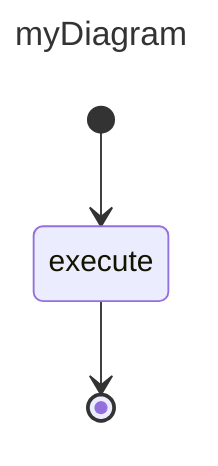

# mState — Unified System Specification

**Date:** 2026-04-06  
**Status:** Approved

---

## 1. Overview

`mstate` is a TypeScript finite state machine (FSM) library with two usage modes:

1. **Code API** — build a state machine programmatically using a fluent builder
2. **Mermaid parser** — declare a state machine in `stateDiagram-v2` Mermaid syntax (inline string or markdown file) and receive a fully constructed machine

The library is headless and logic-agnostic. Business logic is decoupled via an Observer pattern: the machine emits typed events at lifecycle boundaries; user code subscribes and reacts. The machine never calls user code directly.

---

## 2. Gap Analysis (resolved)

The following gaps were identified in `doc/spec/` and resolved in this document:

| Gap | Resolution |
|---|---|
| **Choice node guards** | Transitions carry `(SMStatus, exitCode?)`. Choice nodes evaluate outgoing transitions in declaration order; first match wins. Unlabeled transition = default (matches any). No events emitted for Choice nodes — they are routing-transparent. |
| **Parallel regions (`--`)** | Deferred to a future phase. Fork/Join covers the explicit parallel pattern. Mermaid `--` syntax is not parsed in v1. |
| **`stop()` semantics** | Immediate halt: all active states set to `Canceled`, `onSMStopped` emits `Canceled`, no further routing fires. |
| **`validate()` vs `start()`** | `validate()` is an optional pre-flight step; throws `SMValidationException`. `start()` does not re-validate but may throw `SMRuntimeException` at runtime. |
| **Mermaid parser** | Uses `@a24z/mermaid-parser` (50KB, no DOM) to produce the Mermaid AST. mState writes only the builder pass that maps AST nodes to builder calls. `smConfig` YAML parsed with `js-yaml`. |
| **Validation rules** | Consolidated in Section 6 of this document. |
| **Initial/Final state rules** | Exactly one `Initial` at the top level; Groups have their own internal `Initial`. All paths must reach a `Terminal`. See Section 6. |

---

## 3. Architecture

### 3.1 Design approach

Layered engine (Approach B): `StateMachine` is a thin facade over focused internal collaborators. No collaborator knows about another; `StateMachine` orchestrates.

### 3.2 File structure

```
src/
  index.ts                  ← public exports
  types.ts                  ← branded IDs, SMStatus, SMStateType, event interfaces
  exceptions.ts             ← SMValidationException, SMRuntimeException
  TypedEvent.ts             ← TypedEvent<T>, Handler<T>
  StateMachine.ts           ← ISMStateMachine facade
  StateRegistry.ts          ← add/remove/query ISMState by id
  TransitionRegistry.ts     ← add/remove/query ISMTransition by id
  TransitionRouter.ts       ← resolves next state(s) given (fromId, status, exitCode)
  Validator.ts              ← graph validation; throws SMValidationException
  states/
    InitialState.ts
    TerminalState.ts
    ChoiceState.ts
    ForkState.ts
    JoinState.ts
    GroupState.ts
    UserDefinedState.ts
  parser/
    MermaidParser.ts        ← maps @a24z/mermaid-parser AST → builder calls
    ConfigParser.ts         ← parses smConfig YAML block via js-yaml
    createStateModel.ts     ← public overloads: string | filepath → ISMStateMachine[]
```

### 3.3 Class diagram (relationships)

```
ISMStateMachine (interface)
  └── StateMachine (implements)
        ├── StateRegistry          (owns)
        ├── TransitionRegistry     (owns)
        ├── TransitionRouter       (owns, reads both registries)
        ├── Validator              (owns, reads both registries)
        └── TypedEvent ×4          (onSMStarted, onStateStart, onStateStopped, onSMStopped)

ISMState (interface)
  ├── InitialState
  ├── TerminalState
  ├── ChoiceState
  ├── ForkState
  ├── JoinState     ← adds: onDependencyComplete(), isComplete, reset(), receivedPayloads
  ├── GroupState    ← adds: addState(), removeState(), internal StateRegistry + TransitionRegistry
  └── UserDefinedState

ISMTransition (interface)
  └── SMTransition  (id, fromStateId, toStateId, status?: SMStatus, exitCode?: string)

TypedEvent<T>
  ├── add(handler: Handler<T>): void
  └── emit(event: T): void
```

---

## 4. Core Types

```ts
// Branded IDs
type SMStateMachineId = string & { readonly __brand: 'SMStateMachineId' };
type SMStateId        = string & { readonly __brand: 'SMStateId' };
type SMTransitionId   = string & { readonly __brand: 'SMTransitionId' };

enum SMStatus {
    None      = "none",
    Active    = "active",
    Ok        = "ok",
    Error     = "error",
    Canceled  = "canceled",
    Exception = "exception",
    AnyStatus = "any"   // wildcard: matches any status on a transition
}

enum SMStateType {
    Initial     = "initial",
    Terminal    = "terminal",
    Choice      = "choice",
    Fork        = "fork",
    Join        = "join",
    Group       = "group",
    UserDefined = "userDefined"
}
```

---

## 5. Event Interfaces

```ts
interface SMStartedEvent<T = unknown> {
    statemachineId: SMStateMachineId;
    payload: T | undefined;
}

// Emitted when entering a new state (after routing).
// Normal transitions emit a single event. Fork emits an array of events (one per branch) in a single call.
interface SMStateStartEvent<T = unknown> {
    fromStateId: SMStateId;
    transitionId: SMTransitionId;
    toStateId: SMStateId;
    payload: T | undefined;
}

// onStateStart handler receives either a single event or an array (Fork case).
// TypedEvent<SMStateStartEvent | SMStateStartEvent[]>

interface SMStateStoppedEvent<T = unknown> {
    stateId: SMStateId;
    stateStatus: SMStatus;
    exitCode: string | undefined;
    payload: T | undefined;
}

interface SMStoppedEvent<T = unknown> {
    statemachineId: SMStateMachineId;
    stateStatus: SMStatus;
    payload: T | undefined;
}
```

---

## 6. Public API (`ISMStateMachine`)

```ts
interface ISMStateMachine {
    id: SMStateMachineId;

    // Observer hooks
    onSMStarted:    TypedEvent<SMStartedEvent>;
    onStateStart:   TypedEvent<SMStateStartEvent | SMStateStartEvent[]>; // array for Fork
    onStateStopped: TypedEvent<SMStateStoppedEvent>;
    onSMStopped:    TypedEvent<SMStoppedEvent>;

    // Lifecycle
    start(): void;    // throws SMRuntimeException
    stop(): void;     // immediate halt, emits Canceled
    validate(): void; // optional pre-flight; throws SMValidationException

    // Called by user code when a state finishes executing
    onStopped(
        id: SMStateId,
        status: SMStatus,
        exitCode?: string,
        payload?: unknown
    ): void;

    // State builder methods (create + register in one call)
    createInitial(id: SMStateId, payload?: unknown): ISMState;
    createState(id: SMStateId, config?: Record<string, unknown>): ISMState;
    createTerminal(id: SMStateId): ISMState;
    createChoice(id: SMStateId): ISMState;
    createFork(id: SMStateId, clonePayload?: (p: unknown) => unknown): ISMState;
    createJoin(id: SMStateId): JoinState;
    createGroup(id: SMStateId): GroupState;

    // Transition builder
    createTransition(
        id: SMTransitionId,
        fromId: SMStateId,
        toId: SMStateId,
        status?: SMStatus,
        exitCode?: string
    ): ISMTransition;

    // Registry queries
    getState(id: SMStateId): ISMState | undefined;
    getStateCount(): number;
    getStateIds(): ReadonlyArray<SMStateId>;
    getActiveStateIds(): ReadonlyArray<SMStateId>;
    getTransition(id: SMTransitionId): ISMTransition | undefined;
    getTransitionCount(): number;
    getTransitionIds(): ReadonlyArray<SMTransitionId>;

    addState(state: ISMState): void;
    removeState(id: SMStateId): void;
    addTransition(transition: ISMTransition): void;
    removeTransition(id: SMTransitionId): void;
}
```

If no id is provided for a state or transition, a default is generated: `state#${crypto.randomUUID()}`, `transition#${crypto.randomUUID()}`.

---

## 7. Transition Routing & Execution Lifecycle

### 7.1 `start()`

1. Find all `Initial` states in `StateRegistry`. If none → throw `SMRuntimeException`.
2. Emit `onSMStarted`.
3. For each `Initial` state: immediately route through it (Initial states fire their outgoing transition without waiting for `onStopped`). Emit `onStateStart` for the first real state.

### 7.2 `onStopped(stateId, status, exitCode?, payload?)`

1. Look up state; throw `SMRuntimeException` if not found or not `Active`.
2. Set state's `stateStatus` to `status`.
3. Emit `onStateStopped { stateId, stateStatus: status, exitCode, payload }`.
4. Call `TransitionRouter.resolve(stateId, status, exitCode)` → `RouteResult`.
5. Act on `RouteResult` (see 7.3).

### 7.3 `RouteResult` variants

| Kind | Condition | Action |
|---|---|---|
| `transition` | Matching outgoing transition(s) found | Set target state Active; emit `onStateStart` |
| `terminal` | Target is a `TerminalState` | Emit `onSMStopped { status, payload }` |
| `noMatch` | Narrowing transition exists but status didn't match | Emit `onSMStopped { status: Error, payload: <message> }` |
| `none` | No outgoing transitions at all | Throw `SMRuntimeException` |

### 7.4 Routing rules by state type

**UserDefined / Group:** Find outgoing transitions where `(transition.status === AnyStatus || transition.status === incomingStatus) && (transition.exitCode === undefined || transition.exitCode === incomingExitCode)`. First match wins. Match order follows `addTransition` call order (insertion order).

**Choice:** Transparent — inherits `(status, exitCode)` from the transition that led to it. Applies the same matching rules on its own outgoing transitions. No `onStateStart` or `onStateStopped` emitted for the Choice node.

**Fork:** Resolves all outgoing transitions simultaneously. Emits a single `onStateStart` call with an **array** of `SMStateStartEvent[]`, one per branch. Each branch target is set to `Active`.

**Join:** On each incoming `onStopped`, calls `JoinState.onDependencyComplete(evt)`. When `isComplete` (all incoming transitions received): calls `joinState.reset()`, then routes forward with `SMStatus.Ok` and `receivedPayloads` as payload.

### 7.5 `stop()` — immediate halt

1. For each active state: set `stateStatus = Canceled`.
2. Clear active state set.
3. Emit `onSMStopped { status: Canceled }`.
4. No further routing or events.

### 7.6 Sequence: normal state transition

```
User code                StateMachine              Observer
    |                        |                         |
    |-- onStopped(id, Ok) -->|                         |
    |                        |-- setState(Ok)           |
    |                        |-- emit onStateStopped -->|
    |                        |-- router.resolve()       |
    |                        |-- setState(Active)       |
    |                        |-- emit onStateStart  -->|
    |                        |                         |
    |<-- [user handles onStateStart, executes logic]   |
    |                        |                         |
```

---

## 8. Validation Rules

`validate()` throws `SMValidationException` on the first violation (message identifies the rule).

**Structural:**
1. Exactly one `Initial` state at the top level.
2. At least one `Terminal` state reachable from the initial state.
3. Every state is reachable from the initial state (no orphans).
4. Every non-terminal state has at least one outgoing transition.
5. Every transition's `fromStateId` and `toStateId` exist in the registry.
6. No duplicate transition IDs.

**Choice:**
7. Every `Choice` state has at least one outgoing transition.
8. No two outgoing transitions from the same `Choice` share the same `(status, exitCode)` pair.
9. At most one outgoing transition per `Choice` is the "default" (no status / `AnyStatus`, no exitCode).

**Fork/Join:**
10. Every branch leaving a `Fork` must lead to a `Join` before reaching a `Terminal`.
11. A `Join` state must not be directly followed by a `Choice`.
12. A `Join`'s `incoming` count must equal the number of fork branches feeding it.

**Group:**
13. Every `Group` must contain exactly one `Initial` sub-state.
14. Every `Group` must contain at least one `Terminal` sub-state reachable from its internal initial.
15. Transitions inside a `Group` must not reference states outside that group.

**Transition:**
16. `SMStatus.AnyStatus` on a transition must not be combined with an `exitCode`.

---

## 9. Mermaid Parser

### 9.1 Public API

```ts
// Overload 1: inline diagram string
function createStateModel(diagram: string): ISMStateMachine[];

// Overload 2: markdown file path (async, Node.js fs)
function createStateModel(
    filePath: string,
    options: { fromFile: true }
): Promise<ISMStateMachine[]>;
```

A file may contain multiple `stateDiagram-v2` blocks, each identified by its `title` frontmatter. `createStateModel` returns all diagrams found.

### 9.2 Dependencies

| Package | Purpose |
|---|---|
| `@a24z/mermaid-parser` | Tokenises and parses `stateDiagram-v2` → AST (50KB, no DOM) |
| `js-yaml` | Parses `smConfig` YAML blocks |

### 9.3 File format

A markdown file can contain multiple diagram definitions. Each diagram is optionally preceded by an `smConfig` YAML block keyed by diagram title:

````markdown
```yaml smConfig
myDiagram:
  config:
    property1: value1
  states:
    execute:
      config:
        retries: 3
  initial:
    someProperty: value
```


````

### 9.4 Builder pass — AST node → builder call mapping

`MermaidParser` receives the AST from `@a24z/mermaid-parser` and calls `StateMachine` builder methods:

| AST node | Builder call |
|---|---|
| `[*]` as transition source | `createInitial()` (once per diagram) |
| `[*]` as transition target | `createTerminal()` (once per diagram) |
| `state X <<choice>>` | `createChoice(X)` |
| `state X <<fork>>` | `createFork(X)` |
| `state X <<join>>` | `createJoin(X)` |
| `state X { ... }` | `createGroup(X)`, recurse into body |
| Plain state reference | `createState(X)` |
| `A --> B : Ok/planA` | `createTransition(_, A, B, SMStatus.Ok, "planA")` |
| `A --> B : ok` | `createTransition(_, A, B, SMStatus.Ok)` |
| `A --> B` (no label) | `createTransition(_, A, B)` — unqualified |

Transition label parsing: labels are split on `/`. The left part maps to `SMStatus` (case-insensitive). The right part (if present) is the `exitCode`. An empty label means unqualified.

### 9.5 Error handling

`MermaidParser` throws `SMValidationException` for:
- Unrecognised `<<type>>` annotation
- Malformed transition label (e.g. `Ok/planA/extra`)
- Reference to an undeclared state

`ConfigParser` throws `SMValidationException` for:
- Invalid YAML syntax
- Config key references a state not present in the diagram

---

## 10. Configuration

Configs are plain JSON-compatible objects (`Record<string, unknown>`). They are stored on states/machines and are queryable by user code. The library makes no assumption about content.

```ts
// Accessing config at runtime
const config = statemachine.getState("execute")?.config;
```

Initial payloads on `Initial` states are forwarded as the `payload` field in the first `onStateStart` event.

---

## 11. Error Handling Summary

| Exception | Thrown by | When |
|---|---|---|
| `SMValidationException` | `validate()`, `MermaidParser`, `ConfigParser` | Structural/graph rule violations, malformed syntax |
| `SMRuntimeException` | `start()`, `onStopped()` | No initial state, unknown state id, state not active, no matching route |

---

## 12. Testing Strategy

### 12.1 Unit tests

Co-located with source files as `*.test.ts`. Each internal collaborator is tested in isolation:

| Unit | What to test |
|---|---|
| `TypedEvent` | add/emit, multiple handlers, no handlers |
| `StateRegistry` | add/remove/get/count/ids, duplicate id rejection |
| `TransitionRegistry` | same as StateRegistry |
| `TransitionRouter` | each state type's routing rules: UserDefined, Choice (transparent, default, no-match), Fork (all branches), Join (partial then complete), Group exit |
| `Validator` | each of the 16 validation rules — one test per rule, valid case + violation case |
| `MermaidParser` (builder pass) | each AST node → builder call mapping, label parsing (`Ok/planA`, bare `ok`, empty), error cases |
| `ConfigParser` | YAML parsing, multi-diagram keying, state config application, error cases |
| `StateMachine` | `start()` sequence, `stop()` halt, `onStopped()` full lifecycle, event emission order |
| `createStateModel` | string overload, file overload (mock fs), multi-diagram file |

**Coverage threshold:** 80% lines/branches/functions/statements, enforced by Jest (matches project `jest.config` settings).

### 12.2 Integration tests

One test file per spec document, located in `src/__integration__/`. Each test constructs the exact state machine described in the spec (using the code API) and asserts the full event emission sequence.

| Test file | Covers | Key assertions |
|---|---|---|
| `001.entities.test.ts` | All entity types constructable | All `create*` methods return correctly typed objects; branded IDs reject plain strings |
| `002.basic_state.test.ts` | `doc/spec/002` | Event sequence: `onSMStarted` → `onStateStart` → `onStateStopped` → `onSMStopped` |
| `003.basic_transition.test.ts` | `doc/spec/003` | Unqualified transition fires on any status |
| `004.transition_narrowing.test.ts` | `doc/spec/004` | Narrowed transition fires on `Ok`; SM exits with `Error` on mismatch |
| `005.transition_selection.test.ts` | `doc/spec/005` | Choice routes to correct branch per status; default branch catches remainder; no Choice events emitted |
| `006.transition_by_exit_code.test.ts` | `doc/spec/006` | Choice routes correctly on `(Ok, planA)` vs `(Ok, planB)` vs `AnyStatus` |
| `007.payloads.test.ts` | `doc/spec/007` | Payload forwarded through `onStateStopped` → `onStateStart` → `onSMStopped` |
| `008.fork_join.test.ts` | `doc/spec/008` | Fork emits array `onStateStart`; Join waits for all branches; `receivedPayloads` aggregated; `reset()` called |
| `009.group_execution.test.ts` | `doc/spec/009` | Group acts as single state externally; internal initial fires automatically; group status reflects terminal sub-state |
| `010.configuration.test.ts` | `doc/spec/010` | Config accessible on machine and states at runtime; initial payload forwarded correctly |

Each integration test asserts:
1. Event names emitted in the correct order (captured via spy handlers on all four `TypedEvent` hooks)
2. Event payloads match the exact values specified in the spec's execution section
3. No unexpected events fire

### 12.3 Linting & formatting

All source and test files must pass `npm run lint` (ESLint) and `npm run typecheck` (TypeScript strict mode) before any PR merges. The `prepublishOnly` hook enforces: typecheck → lint → test → build.

---

## 13. Out of Scope (v1)

- Parallel regions (`--` Mermaid syntax) — deferred; use Fork/Join instead
- State machine re-run / multiple runtime instances from one config
- Async state execution (library is synchronous; user code manages async externally)
- Persistence / serialisation of machine state
